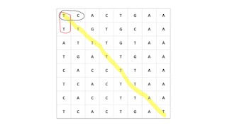
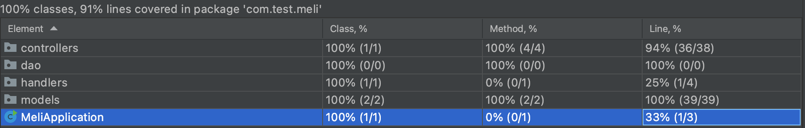

# RETO DE MERCADO LIBRE

Esta es una solución a un reto propuesto por el equipo de Mercado Libre. El enunciado del mismo se encuentra al final.

## SOLUCIÓN PROPUESTA

El lenguaje utilizado para la solución del ejercicio es Java 8, con el uso del framework SpringBoot para la creación del servicio rest. 

La solución planteada fue recorrer el arreglo de strings con dos bucles anidados, similar a como se haría con una matriz NxN. Se analizan por pares de letras para encontrar si son iguales o no y llevar una cuenta incremental de ser así, de lo contrario, se reinicia la cuenta. Cuando la cuenta llega a 3 es porque hay una secuencia de 4 carácteres iguales. Cuando se tengan al menos dos de estas secuencias el método encargado de la detección devolverá verdadero, de lo contrario seguirá buscando y si no encuentra al menos dos secuencas devuelve falso. 

A grandes rasgos el algoritmo recorre la "matriz" como se muestra en la siguiente imagen, donde hay un análisis horizontal y vertical que se ejecutan consecutivamente y un análisis diagonal que se ejecuta en determinadas condiciones, pero que requiere de un bucle extra, por lo que es un poco más costoso computacionalmente hablando. Una forma de mejorar la velocidad de este algoritmo podría ser ejecutarlo en multihilo, pero no se quiso agregar más complejidad al método.

Se realizaron algunos test unitarios con diferentes casos para verificar que los métodos hagan correctamente su trabajo, principalmente el método de detección de mutantes que es el núcleo de la aplicación. El test coverage integrado de Intellij Idea arrojó un 91% de cobertura como se puede observar a continuación: 

Para la persistencia de los adn se eligió una base de datos orientada a documentos como lo es MongoDB, debido a la naturaleza de los datos y a que los arreglos de adn podrían a llegar a variar en tamaño.

## EJECUCIÓN DE LA API

La api al ser desarrollada en Java 8, con SpringBoot y con el sistema de dependencias Maven, puede ser empaquetado en un .jar con el comando "mvn package" y ser ejecutado por cualquier servidor que soporte este tipo de archivo. En este caso se eligió utilizar docker para contenerizar la aplicación y se subio la imagen a dockerhub, donde se puede encontrar con el nombre "oscarpuerto/test-meli".

Para ejecutarlo en cualquier máquina que tenga docker instalado, se puede usar el comando:

docker run -d -p 80:8080 oscarpuerto/test-meli:1.0

Si se quiere construir una imagen propia puede clonar el repositorio y ejecutar el comando "docker build ." en una cli que se encuentre ubicada en la raíz del proyecto, aunque antes debe modificar el arhcivo application.properties con la url de conexión a su base de datos de MondoDB.

## CONSUMO DE LA API

Como Hosting se plantea usar MongoDB Atlas para la base de datos y una plataforma cloud como hosting de aplicación. En este caso se eligieron dos alternativas: Una IaaS como lo es AWS EC2 corriendo un contenedor de la aplicación en docker y una PaaS como lo es Heroku que compila y corre directamente el código. En este caso, como se está trabajando sobre la capa Free Tier de AWS, el rendimiento percibido es un poco mejor en Heroku, pero por supuesto es debido a la calidad de la infraestructura sobre la cual está corriendo el contenedor de EC2.

Los endpoint para el consumo de estas apis son los siguientes:

### Evaluación de ADN

#### Heroku -> POST https://test-meli-duvan.herokuapp.com/mutant
#### AWS EC2 -> POST http://ec2-54-224-163-238.compute-1.amazonaws.com/mutant

Esta operación permite evaluar un adn (dna) y devolver como respuesta si es un mutante o no lo es. El body debe tener la siguiente estructura:

{
    "dna":["TCACTGAA", "TTGTGCAA", "ATTTGTAA", "TGATTGAA", "CACCTTAA", "TCACTTAA", "CACCTTAA", "TCACTGAT"]
}

Donde la key "dna" es requerida y el value debe ser un array de strings, todos los strings deben tener el mismo número de caracteres y este número debe ser igual también al tamaño del array. De lo contrario la operación va a devolver un error de Bad Request.

### Estadísticas de la API

#### Heroku -> GET https://test-meli-duvan.herokuapp.com/stats
#### AWS EC2 -> GET http://ec2-54-224-163-238.compute-1.amazonaws.com/stats

Esta operación devuelve las estadísticas de los adn (dna) que han sido evaluados previamente por la aplicación. No necesita ningún parámetro adicional.

## ENUNCIADO MERCADO LIBRE
Magneto quiere reclutar la mayor cantidad de mutantes para poder luchar
contra los X-Men.

Te ha contratado a ti para que desarrolles un proyecto que detecte si un
humano es mutante basándose en su secuencia de ADN.

Para eso te ha pedido crear un programa con un método o función con la siguiente firma (En
alguno de los siguiente lenguajes: Java / Golang / C-C++ / Javascript (node) / Python / Ruby):
* boolean isMutant(String[] dna); // Ejemplo Java

En donde recibirás como parámetro un array de Strings que representan cada fila de una tabla
de (NxN) con la secuencia del ADN. Las letras de los Strings solo pueden ser: (A,T,C,G), las
cuales representa cada base nitrogenada del ADN.

### No-Mutante 
A T G C G A 

C A G T G C

T T A T T T

A G A C G G

G C G T C A

T C A C T G

### Mutante
A T G C G A

C A G T G C

T T A T G T

A G A A G G

C C C C T A

T C A C T G

Sabrás si un humano es mutante, si encuentras más de una secuencia de cuatro letras
iguales​, de forma oblicua, horizontal o vertical.
Ejemplo (Caso mutante):

String[] dna = {"ATGCGA","CAGTGC","TTATGT","AGAAGG","CCCCTA","TCACTG"};

En este caso el llamado a la función isMutant(dna) devuelve “true”.
Desarrolla el algoritmo de la manera más eficiente posible.
Desafíos:

## Nivel 1:
Programa (en cualquier lenguaje de programación) que cumpla con el método pedido por
Magneto.

## Nivel 2:
Crear una API REST, hostear esa API en un cloud computing libre (Google App Engine,
Amazon AWS, etc), crear el servicio “/mutant/” en donde se pueda detectar si un humano es
mutante enviando la secuencia de ADN mediante un HTTP POST con un Json el cual tenga el
siguiente formato:

POST → /mutant/
{
“dna”:["ATGCGA","CAGTGC","TTATGT","AGAAGG","CCCCTA","TCACTG"]
}

En caso de verificar un mutante, debería devolver un HTTP 200-OK, en caso contrario un
403-Forbidden

## Nivel 3:
Anexar una base de datos, la cual guarde los ADN’s verificados con la API.
Solo 1 registro por ADN.

Exponer un servicio extra “/stats” que devuelva un Json con las estadísticas de las
verificaciones de ADN: {"count_mutant_dna" : 40, "count_human_dna" : 100, "ratio" : 0.4 }
Tener en cuenta que la API puede recibir fluctuaciones agresivas de tráfico (Entre 100 y 1
millón de peticiones por segundo).
Test-Automáticos, Code coverage > 80%.

